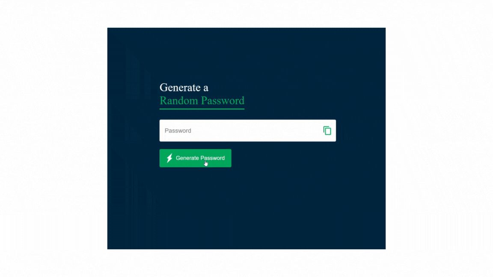

# Password_Generator

<h1> <b>🔐 Password Generator</b> </h1>

<h3>This project is a simple Password Generator that creates 12-character passwords consisting of letters, numbers, and symbols. It is designed to generate strong, hard-to-guess passwords and includes a feature to copy the generated password with a single click.</h3>

<h1> 🚀 Project Overview </h1>

<h3>During the development of this project, the following technologies were used:</h3>

<h4>
<ul> 
<li><b>HTML 📝: </b> To create the structure of the website.</li>
<li><b>SCSS 🎨: </b> For simple styling and layout. </li>
<li><b>JavaScript ⚡:</b> To make the platform interactive and dynamic.</li>
 </ul> 
 </h4>

 <h1> <b>🎯 Key Features:</b></h1>
  
  <h4>
<ul> 
<li><b> Generate strong 12-character passwords.</b> </li>
<li><b> Passwords include letters, numbers, and symbols.</b> </li>
<li><b> Copy the generated password to your clipboard with one click.</b> </li>
 </ul> 
 </h4>

<h4>
<ul> 
<li><b>HTML </b></li>
<li><b>SCSS </b> </li>
<li><b>JavaScript</b></li>
 </ul> 
 </h4>

 <h1> <b> 💻 How to Run the Project </b> </h1>

